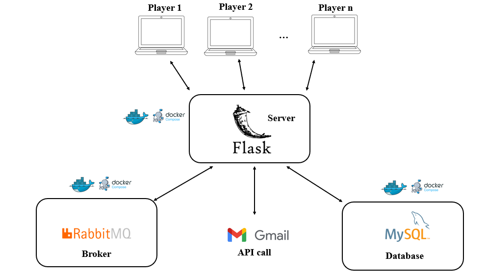

# DAMA-IT
# How to run the Application
 
  - be sure to have python installed on your device (if not it's suggested to install the latest version)  
  - be sure to have docker installed on your device (if not it's suggested to install the latest version)  
  - clone the repository (git clone [URL of the repo]>)  
  - create in the root directory a file called .env that must be fulfilled as follows: 
      RABBITMQ_USERNAME=myuser  
      RABBITMQ_PASSWORD=mypassword  
      RABBITMQ_IP= ... [the IP address of your rabbit container in docker]  
      MYSQL_USERNAME=root  
      MYSQL_PASSWORD=root  
      MYSQL_DB=db  
      EMAIL= ... [the email address you want]  
      EMAIL_PASSWORD= ... [the password of the email address]   
  - navigate the imports in the client.py file and install all the libraries you've not installed yet  
  - run the command "docker-compose up" to build up and run all the needed containers  
  - run python ./client.py to start one client interface  
 
what follows is an overview of what is in place once you've done all the steps above  

  

## Author
[Lorenzo Russo](https://github.com/lorenzoR21)
[Lorenzo Gizzi](https://github.com/loregi01)
